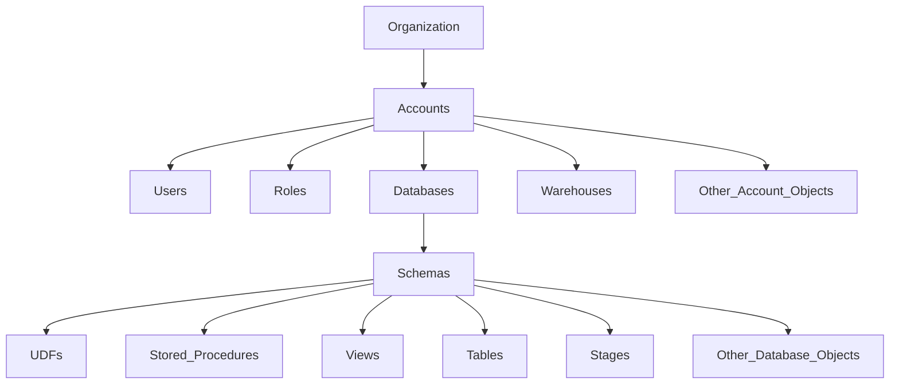

# Full Details about Section 2: Snowflake Architecture

# Multi-Cluster Shared Disk

## Traditional Architectures

1. Shared-Disk 
2. Shared-Nothing

### Shared-Disk 
Storage is common to all the nodes 

#### Advantages
1. Simplicity
2. Shared Storage (Data Management)

#### Disadvantages
1. Network Bottleneck
2. Single Point of Failure
3. Limited Scalability

### Shared-Nothing
Each node is independant and have it's own storage

#### Advantages
1. Scalability
2. High Availability 

#### Disadvantages
1. Expensive
2. More Complex Management. 

### Snowflake Took What? 
Snowflake took the Advantages of these 2 Architecture and made one.   
This is also called as **Multi-Cluster Shared Architecture**.   

***Took***:
1. Central Data Repository. 
2. Massive Parallel Processing Compute Cluster (MMP). - Also, Each Node stores a portion of the data locally. 

## Three Distinct Layer. 

The Three Distinct Layers are: 
1. Database Storage (Lower Layer)
2. Compute Processing/ Query Processing (Middle Layer)
3. Cloud Services (Top Layer)

### Database Storage.

1. It is Decoupled from Compute. 
2. It is called **Hybrid/Compressed Columnar Storage** 
3. It is Called ***Compressed Columnar Storage**, because, the datas are compressed and are stored in block. 
4. These blocks are stored in an external cloud provider. 
5. Snowflake manages all the aspect about storage. 
6. Optimized for OPAL/ Analytical purposes. 

### Compute Layer. 

1. Here is where the query's are computed or processed. 
2. It have Virtual Warehouse or also called just "WareHouse".
3. This is called the **Muscle of the System**.
4. This Layer provides resources like: CPU, Memory, and Temporary Storage.

### Cloud Services. 

1. It is the top layer and it manages different services. 
2. It is called the **Brain of the System**
3. Collection of services to coordinate & manage the components. 
4. Also, run on compute instances of cloud provider.
5. Services Includes: 
    * Authentication. 
    * Access Control. 
    * Query Parsing and Optimization. 
    * Metadata Management. 
    * Infrastructure Management. 

## Hands-On: First Data Loading. 

### You can follow these below steps to load a sample dataset into AWS. (Optional but recommended for first time learners (Either Snowflake or AWS))

1. Visit: https://aws.amazon.com/console/
2. Click: **Sign in to Console**
3. Either Create or Login to AWS Console
    * This [Video](https://youtu.be/Nzv-tzU-UAw?si=JR7VXyc7VB5RB5IT&t=70) can help you to start if this is your first time using AWS (Just the Creation Part (Till 2:19)). 
4. Navigate to S3 Bucket.   
    * ***Reference Image*** 
5. Click **Create Bucket**
    * Type your prefered Bucket Name, try to include a unique word which you only will be known as such we can make it little secure. 
    * Uncheck all the **Block all Public Access** checkbox. 
    * Click **Create Bucket**. 
6. You can get dataset from this file or either from Kaggle using this [Titanic Dataset Link](https://www.kaggle.com/datasets/brendan45774/test-file) or [JPMorgan Chase Stock Data](https://www.kaggle.com/datasets/umerhaddii/jpmorgan-chase-stock-data-2025).
7. If using kaggle, unzip the folder and only upload the **.csv** file to the bucket following these steps: 
    * Navigate to the newly created bucket. 
    * Upload your Titanic.csv file. (I renamed the file from **tested** to **titanic** this goes to **JPMorgan**)
    * Finally click **Upload** and in the next page click  **Close**.
8. Now navigate to **Permissions**
    * Click the **Edit** button for the **Bucket Policy**
    * Copy this (**Remember** get your **ARN** from your bucket and paste at **Resource** removing the one provided here): 
    ```json
    {
        "Version": "2012-10-17",
        "Statement": [
            {
                "Sid": "Snowflake_AllowPublicReadAccess",
                "Effect": "Allow",
                "Principal": "*",
                "Action": "s3:GetObject",
                "Resource": "arn:aws:s3:::s../*"
            },
            {
                "Sid": "Snowflake_AllowListBucket",
                "Effect": "Allow",
                "Principal": "*",
                "Action": "s3:ListBucket",
                "Resource": "arn:aws:s3:::s"
            }
        ]
    }
    ```
8. Now Follow the Snowflake Worksheet Folder for codes. 
    1. **Initial Creation.sql**

## Snowflake Editions.
We have 4 Different Editions. 
1. Standard Edition
2. Enterprise Edition. 
3. Business Critical Edition. 
4. Virtual Private Edition.


|Standard Edition| Enterprise Edition| Business Critical Editoin| Virtual Private Edition| 
|-----------------|-------------------|-------------------------|----------------------|
|Complete DWH| All Standard Edition Feature| All Enterprise Edition Features| All Business Critical Features| 
|Automatic Data Encryption| Multi-Cluster Warehouse| Additional Security Features Such as Customer-Managed Encryption| Dedicated virtual server and compeletly seperate snowflake environment|
|Broad Support for standard and Special Data Types| Time Travel from 0 - 90 Days| Support for data specific regulation| Dedicated Metadata Store|
|Time Travel Upto 1 Day| Materialized Views|Database failover/fallback (disaster recovery)| Isolated from all other Snowflake accounts|
|Fail Safe(Disaster Recovery) Upto 7 Days| Search Optimization| 
|Network Policy| Column-level Security| 
|Secure Data Share| 24-hours early access to weekly new releases|
|Federated Authentication & SSO|
|Premier Support 24/7|

## Compute Cost

### Snowflake Pricing
There are two types of cost. 
1. Compute Cost 
2. Storage Cost
3. Data Transfer (Sometimes)

These two are decoupled. 
Only pay for what we need 
Scalable and at affordable cloud price
Pricing depending on the region/cloud provider

#### Compute. 
1. Active Warehouse. 
2. Cloud Services (Usually won't be charged except **Only charged if Exceeds 10% of warehouse Consumption**)
3. Serverless (These are needed for some specific features like, **Automatic Reclustering**, **Search Optimization**, and **Snowpipe**)


##### Active Warehouse
1. Charged for active warehouse. 
2. Billed by second however minimum of 1 min is charged. 
3. Depends on Size, Time and the activeness of the warehouse. 
4. Charged in Snowflake Credits. 

*Virtual Warehouse Size.* 
| Warehouse Size | Credits | Credits/Seconds| 
| ---------------| --------| ---------------| 
|  XS | 1| 0.0003
| S|  2| 0.0006
|M| 4| 0.0011
|L| 8|0.0022
|XL| 16|0.0044
|2XL| 32|0.0089
|3XL| 64|0.0178
|4XL| 128|0.0356
|5XL| 256|0.0711
| 10XL| 512|0.1422

The price depends on the region and the cloud provider, for instance: $/3 Credits for Standard, $3/Credits for Enterprise, $4/Credits for Business Critical, and need to contact support for the virtual private.

#### Storage Cost. 

There are 2 types: 
1. On-Demand Storage.
2. Capacity Storage. 

There is a monthly fee based on average storage used per month. 
This also based on the region and the cloud platform

| On-Demand | Capacity Storage |
|------------| -----------------| 
|Pay as we use for example $40/Month for 1 TB| Pay $23 for 1 TB for month| 
| Senario1: if we use only 0.1TB*$40=$4| 100GB of storage is used, 1TB*$23=$23| 
| Senario2: if we use 0.8TB*$40=$32| 800GB of storage is used 0.8TB * $40 =$23|
| Use this if we are not sure of the storage | use after getting some experiences and confident about the storage| 

#### Data Transfer

1. Usually Data Ingress is free. 
2. But, Data Egress is not free. 
3. Mostly happen when we try to transfer data cross platform or region. 
4. This mostly happens when we try to **Transfer/Replicate data to different account** in different region and/or cloud provider. 


## Storage Monitoring
The Different Options: 
1. Show Tables; 
2. Table_Storage_Metrics view in **Information_Schema**
3. Table_Storage_Metrics view in **Account_Usage** (wE NEED ROLE OF **ACCOUNTADMIN**)

eg: 
```sql
SHOW TABLE; 
```
```sql
SELECT * FROM DB.information_schema.TABLE_STORAGE_Meterics;
```
```sql
SELECT * FROM SNOWFLAKE.ACCOUNT_USAGE.TABLE_STORAGE_METERICS;
```

**Check *Storage Monitoring* from *Snowflake_Worksheet* folder for sql code reference**

## Resource Monitors. 
Control and Monitor Credit Usage of Warehouse and Account. 
Avalable for all the editions. 
We can use these options:
1. Credit Quota.  (Set Credit Limit)
2. Schedule. ()
3. We can select the Type: **Account** or **Warehouse**
4. We can select Multiple Warehouses too. 

We can set **Actions**
1. Notify.
2. Suspend and Notify. 
3. Suspend Immediately and Notify.

We can use more than 100%   
These resource monitors can only be created by **AccountAdmin** but we can give **Monitor** or **Modify** previleges to some users. 

1. These Monitor can be used to track the warehouse credit usage. 
2. Can be suspended if limit reached. 
3. Can not Prevent cloud service usage. 

## Warehouse and Multi-Clustering

### Warehouse. 
Warehouse is used to execture queries and operations by providing **Compute Resources eg(Memory, CPU etc..)**  

We can define a warehouse with these definitions: 
1. Type
2. Size
3. Multi-Cluster (Starting from Enterprise Edition)

#### Types of Warehouse. 
1. Standard. (Usually sutable for most of the use cases)
2. Snowpark-Optimized. (Recommended for memory intensive workloads such as ML Training)

#### Sizes of Warehouse. 
We already talked about Standard Sizes. For the **Snowpark-Optimized** we don't have **XS** and **S** and all the other sizes are multiplied exactly 1.5 times of the standard size or from the **M Size** of Snowpark-Optimized doubling the size as we did for Standard. 

**<ins>Snowpark-Optimized Table<ins>**

|Warehouse Size| Warehouse Credit|
|--------------|-----------------|
|M|6|
|L|12|
|XL|24|
|2XL|48|
|3XL|96|
|4xL|192|
|5XL|384|
|6XL|768|

#### Multi-Cluster Warehouse. 

When we have a lot of **Concurrent Users** and we will have a lot of queue of queries, so when we have lot of queries we **Cluster** Multiple compute nodes together as one **multi-cluster Warehouse**.   

1. Snowflake can also Autoscale this feature.  
2. Great for more **Concurrent Users**.  
3. Not Ideal for more complex workload. (for this prefered way is: **Scale UP**)
4. Multi-Clustering is **Scaling Out**. 

##### Modes of Multi-Clustering. 
1. Maximized. 
2. Auto-Scale.

Maximized will always have the same amount of Cluster eg(Min==Max). (Good for **Static Workload**)   
For Auto-Scale is not Equal amount of Cluster. (Good for **Dynamic Workload**)

###### Auto-Scale. 
Types of Scaling Policy. 
1. Standard. (**Favouring Starting Additional Warehouses**)
2. Economy. (**Favouring Conserving Credits rather than Starting Additional Warehouse Immediately**)

Doc for [Reference](https://docs.snowflake.com/en/user-guide/warehouses-multicluster) and refer for **Setting the scaling policy for a multi-cluster warehouse**

|Policy|Description|Cluster Starts|Cluster Shutdown|
|------|-----------|--------------|----------------|
|Standard|Favours Creating Cluster to prevent Query Queuing|Starts a Cluster When snowflake estimates that currently running clusters don't have enough resources to handle any additional Queries. For Warehouse with a **MAX_CLUSTER_COUNT** of 10 or less, snowflake starts one additional cluster. For Warehouse with a **MAX_CLUSTER_COUNT** greater than 10, snowflake will start multiple cluster at once to accommodate rapid increase in workflow| After Sustained period of low load, snowflake shuts down one or more of the least-loaded cluster when the queries running on them finish. When the **Cluster Count** is greater than 10, snowflake might shutdown multiple cluster at a time. When the **Cluster Count** is less than 10 or 10, snowflake shutdowns the idle cluster one at a time.|
|Economy|Favours Consuming Credits rather than starting additional warehouse which may result in queries being queued and taking longer to complete.| Only if the system estimate there's enough query load to keep the cluster busy for atleast **6 minutes**| Snowflake marks the least-loaded cluster for shutdown if estimates the cluster has less than **6 minutes** of work left to do. When the cluster count is higher than 10, Snowflake might shutdown multiple cluster at a time. When the cluster count is 10 or less, snowflake shuts down the idle cluster one at a time.|

## Hands-On: SettingUp Multi-Cluster Warehouse. 

### **How to setup a Multi-Cluster Warehouse?**
1. We need the Role of **Account Admin**, **SecurityAdmin** or **SysAdmin**, without these it is not possible to setup. 

**Setup in Code**

```sql
CREATE OR REPLACE WAREHOUSE SECTION2_WAREHOUSECREATION_WH
WITH 
WAREHOUSE_TYPE= STANDARD -- can also use SNOWPARK-OPTIMIZED, but remember to add the warehouse size starting from Medium. 
WAREHOUSE_SIZE=XSMALL
MIN_CLUSTER_COUNT=1
MAX_CLUSTER_COUNT=2
AUTO_RESUME=TRUE
AUTO_SUSPEND=300 -- considered in seconds, so 300 seconds is 5 min.
COMMENT='This is a Warehouse from Section2 in Warehouse Creation';

ALTER WAREHOUSE SECTION2_WAREHOUSECREATION_WH SUSPEND;
```

## Snowflake Objects
1. We can add multiple account under one organization

### Hierarchy of Objects in Snowflake. 



## SnowSQL
1. SnowSQL is a Command Line Connection
2. We can execute Queries, Load, and Unload Data on our Local Machines. 
3. We can perform all DDL & DML Operations like: **Creation of Table, Insert data in talbes, load and unload data**
4. Supported Machines: **Windows**, **MacOS**, and **Linux**