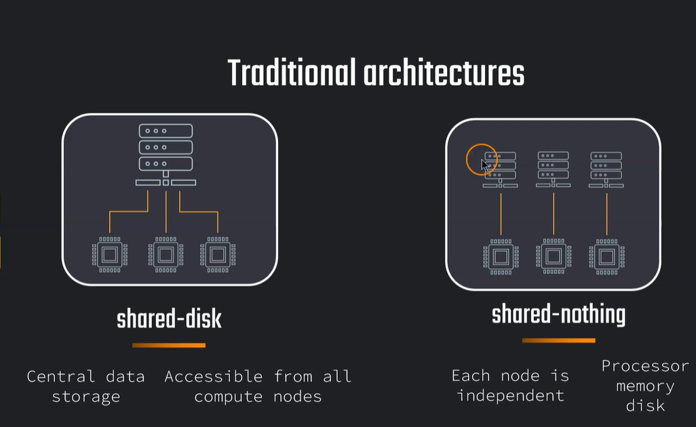

# Full Details about Section 2: Snowflake Architecture

# 9. Multi-Cluster Shared Disk

## Traditional Architectures

1. Shared-Disk 
2. Shared-Nothing

## Shared-Disk

This has a central storage unit. Accessible from all compute nodes.

## Shared-Nothing

Each Node is Independent with own processor, memory and disk. 

## How Snowflake Use the Benifits of these Architectures. 

It is called **Multi Cluster Shared-Data** 
1. Central Data Repository
2. Massive Parallel Processing Compute Cluster, Each node stores a portion of the data locally. 

# 10. Three Distinct Layer of Snowflake

1. DataBase Storage
2. Compute Processing
3. Cloud Service 

## DataBase Storage Layer

**Compressed Columnar Storage**
Decoupled Compute & Storage 
Blob Storage (AWS, Azure, GCP)
Snowflake Manages all aspects about storage
Optimized for OLAP / analytical purposes

## Compute Processing Layer
This is the Query Processing Layer and also called as **Muscle of the System**.
Queries are processed using Virtual Warehouse
Warehouse = MPP Compute Cluster (Multiple Compute Nodes)
Provides Resources: **CPU, Memory, and Temporary Storage**

## Cloud Services Layer. 
This is the **Brain of the System**. 
Collection of Services to Coordinate & Manage the components.

Takes care of: 
1. Authentication. 
2. Access Control. 
3. Metadata Management. 
4. Query Parsing and Optimization. 
5. Infrastructure Management.

# 12. Snowflake Editions.

1. Standard.
2. Enterprise. 
3. Business Critical. 
4. Virtual Private. 

| **Standard** | **Enterprise** | **Business Critical** | **Virtual Private** | 
|----------|------------|--------------------|-------------|
|Complete DWH| All Standard Features| All Enterprise Feature| All Business Critical Features| 
| Automatic Data Encryption| Multi-Cluster Warehouse| Additional Security features such as customer-managed encryption| Dedicated virtual servers and completely seperate Snowflake environment|
| Broad Support for Standard and special data types| Time Travel up to 90 days| Support for data specific regulation| Dedicated metadata store Isolated from all other snowflake accounts
| Time Travel up to 1 day| Materialized View| Database failover/failback (Disaster Recovery)|
| Disaster Recovery for 7 days beyond time travel| Search Optimization|
| Network Policies| Column-Level Security| 
| Secure data Share| 24-hours early access to weekly new releases| 
| Federated Authentication & SSO| 
| Premier Support 24/7| 

# 13. Snowflake Pricing

## Types of Cost
1. Compute
2. Storage
3. Data Transfer

These both are decoupled, benifit are we can scale them independently. 
Pay only for what we need. 
Scalable and at affordable cloud price
Pricing depending on the region/cloud provider

### Compute 
1. (Active)Warehouse -> Standard Query Processing
2. Colud Services -> Behind-the-scenes cloud service tasks (ONly charged if exceeds 10% of warehouse consumption)
3. Serverless -> Search Optimization Snowpipe (Managed by snowflake)

#### Active Warehouse
* Charged for active warehouse per hour
* Billed by second (minimum of 1 min)
* Depending on the size of the warehouse
Time/ Active Warehouse/ Size
* Charged in Snowflake Credits

##### Virtual Warehouse Sizes
xs ⬡ 1  
S ⬡⬡ 2  
L ⬡⬡⬡⬡ 4  
XL ⬡⬡⬡⬡⬡⬡⬡⬡ 8  
2XL ⬡⬡⬡⬡⬡⬡⬡⬡⬡⬡⬡⬡⬡⬡⬡⬡ 16  
3XL ⬡⬡⬡⬡⬡⬡⬡⬡⬡⬡⬡⬡⬡⬡⬡⬡⬡⬡⬡⬡⬡⬡⬡⬡⬡⬡⬡⬡⬡⬡⬡⬡ 32  
4XL ⬡⬡⬡⬡⬡⬡⬡⬡⬡⬡⬡⬡⬡⬡⬡⬡⬡⬡⬡⬡⬡⬡⬡⬡⬡⬡⬡⬡⬡⬡⬡⬡⬡.......⬡⬡⬡⬡⬡⬡ 64  
5XL ⬡⬡⬡⬡⬡⬡⬡⬡⬡⬡⬡⬡⬡⬡⬡⬡⬡⬡⬡⬡⬡⬡⬡⬡⬡⬡⬡⬡⬡⬡⬡⬡⬡⬡⬡⬡⬡⬡⬡⬡⬡⬡⬡⬡⬡.......⬡⬡⬡  256  
6XL ⬡⬡⬡⬡⬡⬡⬡⬡⬡⬡⬡⬡⬡⬡⬡⬡⬡⬡⬡⬡⬡⬡⬡⬡⬡⬡⬡⬡⬡⬡⬡⬡⬡⬡⬡⬡⬡⬡⬡⬡⬡⬡⬡⬡⬡⬡⬡⬡⬡.......⬡ 512  