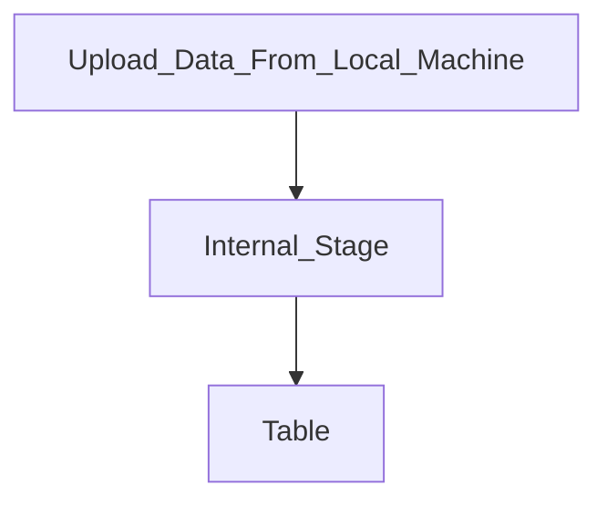
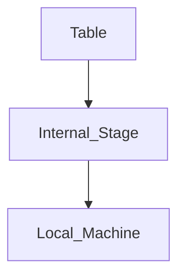
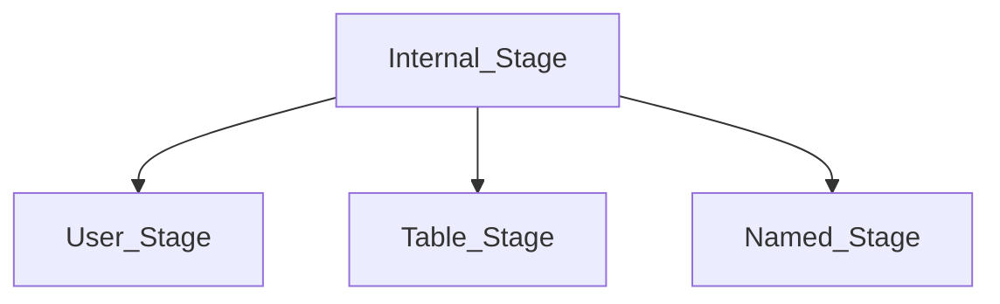

# Data Loading and Unloading

## Stages. 

### What is Stage? 
1. Stage in Snowflake are Locations Used to Store Data. Location where data is Loaded FROM.
2. We can also unload data by Putting data to Stages. 
3. Don't *confuse* with **DataWarehouse Stages**. 

### Types of Stages. 
1. Internal Stages. (**Managed by Snowflake**)
2. External Stages. (**Some Cloud Provider's Buckets**)

#### Internal Stages. 

##### Loading Data.

1. If we use the PUT command the data will be automatically be compressed and it will use the compression **GZip**
2. And it will also automatically encrypt to **128-bit** or **256-bit** Keys

##### Unloading Data


1. When we use GET command to download to our local machine. 
#### Types



##### User Stage
1. Every users have a User Stage. 
2. This Cannot be Dropped or Modified. 
3. Cannot be accessed by other Users. 
4. Tied to a User. 
5. Put files to that stage before loading. 
6. Can load to multiple tables. 
7. Explicitly Remove files again. 
8. Can refer use **@~**.

##### Table Stage
1. Every table has a Table Stage. 
2. It is tied to that particular table. 
3. Cannot be modified or dropped. 
4. Can Load to this stage and copy inot only one table. 
5. Can only be accessed by one table.
6. Can be reffered by **@%tableName**

##### Named Stage. 
1. This is created by a user. 
2. This is a **Snowflake Database Object**
3. Everyone with privileges can access it. 
4. Most Flexible. 
5. Referred to with **@StageName**. 

## External Stages. 
1. Same like Named Stage from the Internal Stage. 
2. But, here we specify the External Cloud Providers Location URL. 

### External Stages have. 
1. URL. 
2. Stored Integration (Preferred Method) for storing the credientials. 
3. File Format (Same like Named Stage) for specifying the File Formats and more. 

### Additional Commands. 
1. ```sql
    LIST @StageName/@~/@%tableName
    ```
2. ```sql 
    COPY INTO Table FROM @StageName 
    ```
3. ```sql 
    COPY INTO @StageName FROM Table
    ```
4. ```sql 
    SELECT * FROM @StageName
    ```
5. ```sql
    SELECT $1, $2, $3 FROM @stageName
    ```

## Hands-ON: Stages. 
Refer **InitialStage.sql** from Snowflake_Worksheet from this section.

## Copy INTO (Bulk-Loading)
1. Files must be staged before loading into any tables. 
2. Also called as **Bulk Loading** 
3. Warehouse is Needed. 
4. Data Transfer cost may apply, if the location we load is from different cloud provider or region. 

### File Formats that can be loaded. 
1. CSV. (Default)
2. Json. 
3. Parquet.
4. XML. 
5. AVRO. 
6. ORC.

Supports Semi-Structured and Un-Structured Datas too. 

### We can Load using. 
1. Files. 
2. Patter. (eg: **PATTERN=.*sales.*;**)(All the files that contains sales will be loaded). 
3. File_Formats.
    * We can Define File Format Properties in. 
        1. COPY Command.
        2. STAGE. 
        3. File Format Object

## Hands-ON: COPY INTO. 
Refer **CopyInto_Stage.sql** from Snowflake_Worksheet from this section

## File Format. 
1. If we don't specify a type, the File format will take a default of CSV file format. 
2. The default will be over-ruled if we specify a **FILE_FORMAT** in the copy command

### How to create a file format? 

```sql
CREATE FILE FORMAT FileFormateName
    TYPE=CSV
    FIELD_DELIMITER=','
    SKIP_HEADER=1;
```

then we can do: 

```sql
COPY INTO TABLENAME
    FROM @STAGENAME
    FILE_FORMAT=(FORMAT_NAME=FileFormatName);
```

Refer **FileFormat.sql** from this sections Worksheet.

## Insert and Update
Refer **InsertandUpdate.sql** from this section Wroksheet.

## Hands-On Storage-Integrations.
1. Stores a generated identity for external cloud storage. 
2. Refer [Doc](https://docs.snowflake.com/en/user-guide/data-load-s3-config-storage-integration)

### Follow: 
1. Create the Storage Integraion 
eg: 
```sql
CREATE STORAGE INTEGRATION AWS_INTEGRATION
    TYPE=EXTERNAL_STAGE
    STORAGE_PROVIDER='S3'
    ENABLED=TRUE
    STORAGE_AWS_ROLE_ARN='YOUR_IAMROLE'
    STORAGE_ALLOWED_LOCATIONS=('PATH1', 'PATH2')
    STORAGE_BLOCKED_LOCATIONS=('PATH1/BUCKET/PATH')
```

### Accessing the created Storage Integration to our Stage.
```sql 
CREATE OR REPLACE STAGE NEWSTAGENAME
    URL='URLTOEXTERNALSTORAGECLOUDPROVDER'
    STORAGE_INTEGRATION=AWS_INTEGRATION
    FILE_FORMAT=(TYPE=CSV SKIP_HEADER=1)
    PATTERN='.*JPMorgan.*';
```

## SnowPipe

### Data Loading. 
1. Buld Loading. (**Manual Execution**)
2. Continuous Loading. (**SnowPipe**)

### Continuous Loading. 
1. A Pipe is a snowflake object that is create. 
2. That can load data files immediately when they appear in our cloud provider storage. 
3. In the Pipe definition the **COPY INTO Statement** is already defined and the data will load according to the COPY INTO Statement.
4. SnowPipe uses **Serverless Features** 

For the flow refer [Docs](https://docs.snowflake.com/en/user-guide/tables-external-intro#overview-of-setup-and-load-workflows) after this Overview you can learn in depth if needed here: [Docs](https://docs.snowflake.com/en/user-guide/tables-external-auto)

Example: 
```sql
CREATE PIPE NEWPIPENAME
    AUTO_INGEST=TRUE|FALSE
    INTEGRATION=NOTIFICATION_INTEGRATION_NAME
    COMMENT='ANY COMMENT'
    AS COPY INTO TABLE TABLENAME
    FROM @STAGENAME;
```

### SnowPipe Methods. 
1. Cloud Messaging
2. REST API

|Cloud Messaging| REST API| 
|---------------|---------| 
|Uses Event Notification| Calles REST API Endpoints| 
|Only External Stages| Internal Stages & External Stages| 

### Important to know for the exam

|Content|Info|
|-------|-----|
|Serverless|No Dedicated Warehouse|
|Cost|Per-second/per-core Granulatiry (Number of cores in a compute cluster)| 
|Load Time|How large the file is, etc. but Usually will load typically within **1 Minute**|
|File Size| Ideally 100MB - 250MB (or more)(atleast **10MB**)|

1. Snowflake can store metadata to loading and copying smartly. 
2. **Load History** will be stored for 14 Days. 
3. No Duplicate data is loaded as long as it is in this retention period. 
4. Object Will be stored in the Schema. 
5. A pipe can be **Paused** or **Resume** by altering the pipe. 
    ```sql
    ALTER PIPE NEWPIPENAME
        SET PIPE_EXECUTION_PAUSED=TRUE;
    ```
6. This alteration is usually done when we need to transfer the ownership of the pipe. 

## Copy Options. 
1. How data is copied into our tables. 
2. Can also used for Unloading vs. Loading. 

### Types of Copy Options. 
1. ON_ERROR
    * ABORT_STATEMENT (Default for Bulk Loading)
    * CONTINUE
    * SKIP_FILE (Default for SnowPipe)
    * SKIP_FILE_NUM (== OR More)
    * SKIP_FILE_NUM% (== OR More)
2. SIZE_LIMIT = <num> (**Default Null**)
    * Will mention in bytes
    * Next file will be loaded **until** <num> (in bytes) is exceeded (**Default Null**)
    * eg: 25000000 (Bytes) 25 MB can't exceed 25 MB. 
    * Initial load starts from 0MB

3. PURGE = TRUE|FALSE (**Default FALSE**)
    * This will remove the data from the stage after successful loading. 

4. MATCH_BY_COLUMN_NAME= CASE_SENSITIVE| CASE_INSENSITIVE| NONE (**Default None**)
    * Load semi-Structured data Columns by matching field names
    * Columns will be Matches in the Columns in our target table loaded in the same name. 
    * |CASE_SENSITIVE|CASE_INSENSITIVE|NONE|
    |----------------|----------------|----|
    |Matches Case-Sensitive| Matches Case-Insensitive| Loads data in variant column or based on COPY statement|

5. ENFORCE_LENGTH= TRUE|FALSE (**Default True**)
    * True: Produces error if loaded string length is exceeded
    * False: Strings are automatically **Truncated**

6. TRUNCATECOLUMNS=TRUE|FALSE (**Default False**)
    * TRUE: strings are automatically **Truncated**
    * FALSE: Produces error if loaded string length is exceeded

7. FORCE: TRUE|FALSE (**Default False**)
    * TRUE: Loades data even if already loaded. 
    * FALSE: don't load file if they have been loaded before

8. LOAD_UNCERTAIN_FILES=TRUE|FALSE (**Default False**)
    * TRUE: Loades data even if the status is unknown. 
    * FALSE: Won't load files if the status is unknown. 

## Hands-On: Copy-Options.

## Validation Mode
1. Validates the Load instead of Loading. 

**VALIDATION_MODE=RETURN_n_ROWS|RETURN_ERRORS**
    * RETURN_5_ROWS: Validates <n> rows (return error or rows)
    * RETURN_ERRORS: Returns all errors across all files

Refer **ValidationMode.sql** from this Section's Warehouse. 

## Validate Function 

```sql
    VALIDATE(<table_name>, JOB_ID=>{'<query_id>'|'_last'})
```

1. Validates the files loaded in  a past execution of the COPY INTO <table> command and returns all the erros encounterd during the load
2. The **On_Error** should not be **Abort_Statement**.

eg: 
```sql
SELECT * FROM TABLE(VALIDATE(TABLENAME,JOB_ID=> '_last'));
```

## Unloading

```sql 
COPY INTO @STAGENAME
    FROM table_name;
```
1. This can be done for both Internal and External Stages. 
2. File Formats: 
    * CSV (**Default**)
    * TSV, etc...
    * Parquet. 
    * Json
    * XML

3. Can use either **Interface(Cloud Provider)** or **GET Command** for downloading to the Local Machine. 
```sql
GET @internalStage file://<path_to_file>/<filename>
```

### Copy Options for Unloading. 
1. SINGLE = TRUE|FALSE (**Default FALSE**)
    * Split into multiple files
2. MAX_FILE_SIZE<NUM><16777216> (Values in byest)
    * That **16MB** is the Default. 
    * Can be increased upto **5GB**
3. Can also use SELECT
    ```sql
    COPY INTO @STAGE_NAME
    FROM (SELECT ID, NAME, START_DATE FROM TABLE_NAME);
    ```
4. FILE_FORMAT=(TYPE=JSON)(**Default CSV**, but we can change to whatever we want.)
5. HEADER=TRUE(will inclue a header in the output file)(**Default False**)
6. File Prefix can be specified. (**Default: data_**)
    ```sql 
    COPY INTO @STAGE_NAME/MYFILE
    FROM TABLENAME
    FILE_FORMAT(TYPE=CSV)
    HEADER=TRUE;
    ```
7. Suffix will be added automatically