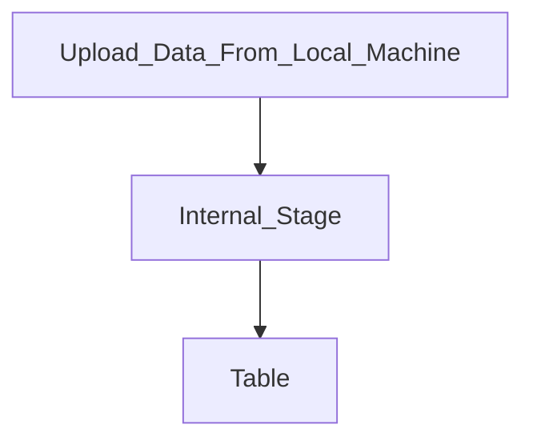
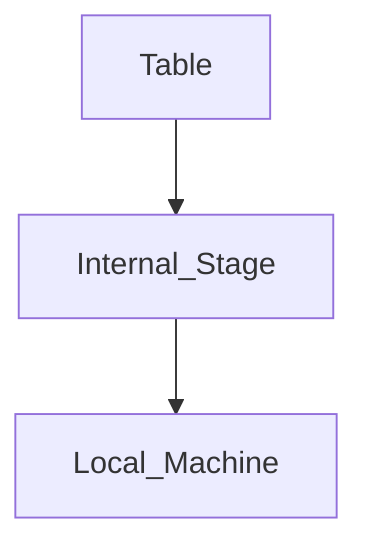
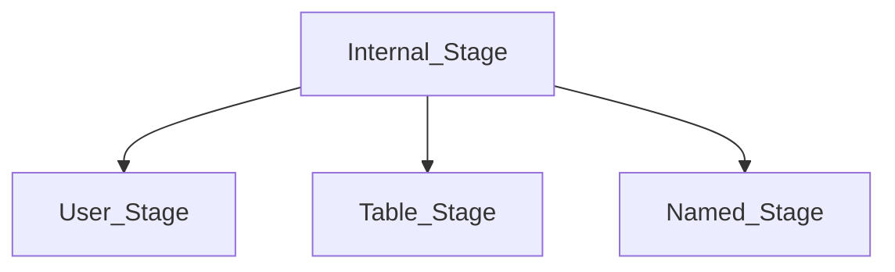

# Data Loading and Unloading

## Stages. 

### What is Stage? 
1. Stage in Snowflake are Locations Used to Store Data. Location where data is Loaded FROM.
2. We can also unload data by Putting data to Stages. 
3. Don't *confuse* with **DataWarehouse Stages**. 

### Types of Stages. 
1. Internal Stages. (**Managed by Snowflake**)
2. External Stages. (**Some Cloud Provider's Buckets**)

#### Internal Stages. 

##### Loading Data.

1. If we use the PUT command the data will be automatically be compressed and it will use the compression **GZip**
2. And it will also automatically encrypt to **128-bit** or **256-bit** Keys

##### Unloading Data

1. When we use GET command to download to our local machine. 
##### Types

###### User Stage
1. Every users have a User Stage. 
2. This Cannot be Dropped or Modified. 
3. Cannot be accessed by other Users. 
4. Tied to a User. 
5. Put files to that stage before loading. 
6. Can load to multiple tables. 
7. Explicitly Remove files again. 
8. Can refer use **@~**.

###### Table Stage
1. Every table has a Table Stage. 
2. It is tied to that particular table. 
3. Cannot be modified or dropped. 
4. Can Load to this stage and copy inot only one table. 
5. Can only be accessed by one table.
6. Can be reffered by **@%tableName**

###### Named Stage. 
1. This is created by a user. 
2. This is a **Snowflake Database Object**
3. Everyone with privileges can access it. 
4. Most Flexible. 
5. Referred to with **@StageName**. 