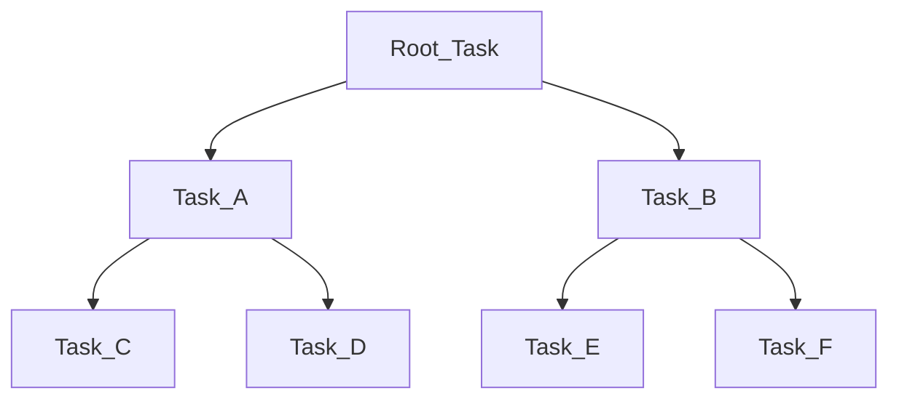

# Data Transformation

## Transformation & Functions. 
1. We can apply transformation in our Query. 
2. We can also use this in our COPY Command. 
3. Rather than loading the entire file we can specify columns on the copy command.

**Transformations During Loading**

| Supported | Not Supported |
|-----------|---------------| 
| Column Reordering | Flatten Function |
| Cast Data Types | Aggregation Function |
| Remove Columns | Group BY |
| Truncate (TruncateColumns) | Filter with Where |
| Subset of SQL Functions | JOINs |

### Functions. 
Supports most standard SQL Functions defined in SQL: 1999 and parts of SQL: 2003 extensions. 

### Types
1. Scalar Functions. 
    * Return one value per invocation (One value per row)
2. Aggregate Functions. (**Estimate Functions**) 
    * Returns one values per entire **Grouping**. 
    * Mathematical Calculations such as Max & Min accross rows.
    eg: 
    ```sql
    SELECT MAX(COLUMNNAME) FROM TABLENAME;
    ```
3. Window Functions. 
    * Subset or Special Case of Aggregate Functions. 
    * They operate on subset of rows. 
    eg: 
    ```sql
    SELECT ORDER_ID, SUBCATEGORY, MAX(COLUMNNAME) OVER (PARTITION BY SUBCATEGORY) FROM TABLENAME;
    ```
4. Table Functions. 
    * Return a set of rows per Input Row. 
    * Used to obtain information about snowflake features. 
    eg: 
    ```sql
    SELECT * FROM TABLE(VALIDATE(TABLENAME, JOB_ID=>'_last'));
    ```
5. System Function. 
    * These are control Functions. 
    * Used to enforce or execute some kind of action in our account. 
    Eg: 
    ```sql
    SELECT SYSTEM$TYPEOF('abc');
    ```
6. UDFs + External Functions. 


## Estimation Functions. 
### The Idea: 
1. Exact Calculations on very large tables can be very compute-/memory-intensive. 
2. But sometimes we are not conserned about the exact values but an approximation is good enough and requires fewer resourses. 

### Types of Aggregations. 
1. Number of **Distinct Values**. 
2. Frequent Values (Frequency with Frequency Count). 
3. Percentile Values.
4. Similarity between 2 Tables. 

#### Number of Distinct Values. 
1. Function: **HLL()**
2. Algorithm: **HyperLogLog**
3. This is a **Cardinality Estimation Algorithm**
4. Used to estimate the number of distinct values. 

#### Use this: 
1. When we have a **Large Input** 
2. When we can accept some kind of **Average error**
    * With this function the average error is **1.62338%**

eg: 
```
HLL(ColumnName,...)
```
**Same as** 

```sql
APPROX_COUNT_DISTINCT(column1,.....)
```

Command: 
```sql
SELECT HILL(COLUMNNAME) FROM SNOWFLAKE_SAMPLE_DATA.TPCH_SF1000.CUSTOMER; 
```

### Frequent Value Estimation. 
1. Function: **APPROX_TOP_K(COLUMN)**
2. Algorithm: **Space-Saving**
3. This is used to estimate the most frequent values along with there frequency. 
4. We can also specify a parameter **K** which is default **1**
    * This **K** is number of values whose frequency should be approximated. 
    * If it's 10, it will return the 10 values of the dataset including there frequency
5. We can also add **Counters**
    * Which is the Max. no of distinct values that can be tracked.
    * Recommanded to use Counter and **Counter>>K** 
    * Count larger => More Accurate.

### Percentile Values
1. Function: **APPROX_PERCENTILE()**
2. Algorithm: **T-Digest** 
3. Used to estimate the percentile values. 
4. All the values will be orderd and will return exactly the percentile what we asked for. 


eg: 
```sql
APPROX_PERCENTILE(COLUMNNAME, <percentile>);
```

**This above command will return the percentile value**


### Similarity of 2 or more sets. 
1. Function: **Minhash** + **APPROXIMATE_SIMILARITY()**
2. Algorithm: Uses **Minhash** first and them uses Union All for the approximate similarity
3. Before it is used to use **Jaccard Similarity Coefficient** to compare similarity. 
    * J(A,B)=(A ∩ B)/(A ∪ B)
    * This is compute expensive
    * Snowflake uses Minhash to estimate this much faster

#### 2 Step Process. 
1. **Minhash** 
    1. 
    ```sql
    SELECT MINHASH(100,*) AS mh FROM TABLENAME;
                    or
    SELECT MINHASH(7,ONECOLUMNNAME) AS msh FROM TABLENAME;
    ```
    2. **K** is the number of hash functions, the larger the k, the more accurate. 
    3. Template: 
    ```sql
    SELECT MINHASH(K, COLUMNNAME/COLUMNNAMES)
    ```
    4. The output will give us a **State** object in a Json format (nothing to do with it manually, but just a reference)

2. **APPROXIMATE_SIMILARITY()**
    1. 
    ```sql
    SELECT APPROXIMATE_SIMILARITY(mh) FROM ((SELECT MINHASH(100,*) AS mh FROM TABLENAME1) UNION ALL (SELECT MINHASH(100,*) AS mh FROM TABLENAME2));
    ```

The output will be a value between 0 and 1, where 0 means the difference is lot and 1 means they are identical.

## User Defined Functions. 
1. Way to extend the functionality of the built in functions. 

### Supported Languages. 
1. SQL. 
2. Python. 
3. Java. 
4. JavaScript

```sql
CREATE FUNCTION add_two(n int)
    RETURNS INT
    AS 
    $$
    n+2
    $$;
```

**Use the Function**

```sql
SELECT add_two(3);
```

If we are using this functions we need to distingish **Two Types of Functions**
1. Scalar Functions. 
2. Tabular Functions. 
    * Retruns a **tabular value** for each **input row**. 
    * If we have one input value we could get multiple columns or multiple rows. 
    * This is a securable schema-level objects.

## Stored Procedures. 
1. Also, another way to extend the functionality.

| Stored Procedures | UDF | 
|-------------------|-----| 
| Typically performs database operations - usually administrative operations like **Delete, Update or Insert**| Typically calculate and return a value| 
| Doesn't need to return a value| Need to return a value| 
| Can call using the Caller or the Owner's rights| No need to have access to objects reference in the function|

### Supported Languages. 
1. Snowflake Scripting
    *Snowflake SQL + Procedural Logic
2. JavaScript
3. Snowpark API
    (Python, Scala, Java)

1. We can use arguments
    * :variable
2. We can reference an object using an argument via IDENTIFIER(:variablename)

### Priviliges 
Can either run using **Caller's** or **Owner's** rights.  
Default run as **Owner**

## External Function
1. User defined function but they are stored and executed outside of snowflake.
2. Calls Code that is executed outside of Snowflake
    * Eg: S3
3. No code stored in the function definition but we just reference the external provider. 
4. We can reference third-party libraries, services and data. 

```sql
CREATE EXTERNAL FUNCTION myAWSFunction(StringValue VARCHAR)
    RETURNS VARIANT
    API_INTEGRATION=AWSAPIINTEGRATION
    AS 'pathtotriggerfunction';
```

5. Remotely executed code will be called **Remote Service**

### Advantages
1. Additional Languages including GO and C#
2. Accessing 3rd-party libraries such as machine learning scoring libraries. 
3. Can be called from snowflake and from other softwares. 

### Limitations
1. We can currently use only Scalar functions. 
2. Slower performance with Overhead + Fewer Optimization.
3. Not Sharable. 

## Secure UDFs & Procedures. 

### How to get Information 
1. DESC FUNCTION 
2. Can also get underlying data using the Optimizer

### How to create a Secure UDFs or Procedures. 
```sql
CREATE SECURE FUNCTION <FUNCTION_NAME>
```

### Trade-Off: 
Reduced query Performance <-> Security

## Sequences. 
1. A Database object. 
```sql
CREATE SEQUENCE MY_SEQ START=1 INCREMENT = 1; 
```
2. Default Startis 1
3. How to call: 
```sql
SELECT MY_SEQ.NEXTVAL;
```
will return the value incrementally
4. This is similar to all the functions, procedures etc, which means we can grant priviliges to these sequnces. 
5. Typically used for default values. 
6. Snowflake dosen't guarantueed gap-free.

## Semi-Structured Data
1. Snowflake have really great native support for these semi-structured datas.
2. Can query using : after column name
    ```sql
    SELECT COLUMN_NAME:objectName FROM TABLENAME; 
    SELECT COLUMN_NAME:objectName.objectFromHierrachy FROM TABLENAME;
    SELECT COLUMN_NAME:objectName.objectFromHierrachy.objectfromhierrachyHierrachy[1]::VARCHAR FROM TABLENAME;
    ```
3. Supported Formats: 
    * JSON
    * XML
    * PARQUET
    * AVRO
    * ORC
4. Deals this with Datatypes
    * Objects -> key and value pair. 
    * Array -> Consists of 0 or more pieces of data.
    * VARIANT :
        * CAN STORE VALUES OF ANY OTHER DATA TYPE INCLUDING ARRAY AND OBJECT
        * SUITABLE TO STORE AND QUERY SEMI-STRUCTURED DATA.
        * VERY IMPORTANT AND HELPFUL DATATYPE
        * SQL **nulls** are just stored as **\"nulls\" *** Strings. 
        * Non-native strings (e.g. dates) are stored in strings.
        * **Maximum length is 16 MB (uncompressed per row)**
        * Load the data as it is and transform it later. 

## Flatten Data
1. 
```
FLATTEN(INPUT=><expression>);
```
2. Then we can use to convert semi-structured data into relational table view
3. 
```
SELECT * FROM TABLE(FLATTEN(INPUT=>[2,4,6]))
```
4. Cannot be used in COPY Command. 
5. Produces a lateral view
    * Contains references to other tables in FROM clause. 

## How to insert JSON Data
1. parse_json('{"key":"value"}')
2. 
```sql
INSERT INTO TABLENAME SELECT PARSE_JSON('{"key":"value"}')
```

## Unstructured Data
1. We can access the Unstructured Data setting up URLs which are stored in the cloud storages. 
2. Share File access URLs.
3. Consider there is an image file in the Stage, we can generate URLs to access the files. 

### Types of URLs
1. Scoped URL -> Encoded url with temporary access to a file. (No access to the stage)(Expires when results cache expires, currently 24 hours.)
2. File URL (Per) -> Permits prolonged access to a specified file (Does not expire)
3. Pre-Signed URL -> HTTP URL used to access a file via a web browser. (We can specify the expiration value/time)

#### Scoped URL
```sql
BUILD_SCOPED_FILE_URL;
SELECT BUILD_SCOPED_FILE_URL(@Stage,'Logo.png');
```

#### File URL
```sql 
BUILD_STAGE_FILE_URL;
SELECT BUILD_STAGE_FILE_URL(@Stage,'Logo.png');
```

#### Pre-Signed URL 
```sql 
GET_PRESIGNED_URL;
SELECT GET_PRESIGNED_URL(@Stage,'Logo.png',60); -- 60 Seconds, so the url will expire in 1 min/ 60 sec.
```
## Directory Tables. 
1. Stores metadata of staged files
    * Layered on a stage, not a separate table that is available as database object
    * And if we have sufficient privileges on the stage, we can query from this table. 
    * This is a property that we can set. 
    * Once we have access to this table we can retrieve file URLs to access files
    * **Needs to be *Enabled* for Stage**

```sql
CREATE STAGE STAGENAME
    FILE_FORMAT(FORMAT_NAME=FILEFORMATNAME)
    FILES=('PATH.CSV')
    DIRECTORY=(ENABLE=TRUE) --Default False
```

```sql
SELECT * FROM DIRECTORY(@STAGENAME);
```

This above command might not return anything because we need to refresh the stage manually. 

```SQL
ALTER STAGE STAGENAME REFRESH;
```

The Directory command will return some information and we can find the File URL from there and it is the same as **BUILD_SCOPED_FILE_URL** (Scoped URL)  

Also the SQL functions can be used in Views, Function etc. 

## Data Sampling
1. We can get a smaller proportion of the entire big database, doing this we can save compute cost, memory cost and more as we are only focusing on a particular set. 

### Use Cases. 
1. Query Development, Data Analysis etc. 
2. Faster & More Cost Efficient (Less Compute Resourses)

### Type of Data Sampling. 
1. Row or Bernoulli 
2. Block or System Method. 

### Row or Bernoulli
1. 
```sql
SELECT * FROM TABLE SAMPLE ROW (<percentage_of_rows>) SEED(15) -- Adding Seed make sure we get the same sample always. 
```
2. We will get a random sample of N% of the entire dataset

### Block or System
1. 
```sql
SELECT * FROM TABLE SAMPLE SYSTEM(<percentage_of_rows>) SEED (15)
```
2. Every block is chosen with percentage p

| Row or Bernoulli | Block or System | 
|------------------| ----------------| 
|Every row is chosen with percentage p| Every block is chosen with percentage p|
| More "Randomness" | More Effective Processing |
| Smaller tables | Larger Tables | 

## Task 
1. We can schedule a task for a command to run in a particular period of time. 
2. Often combined with **Streams** to set up continuous ETL workflow.
```sql
CREATE TASK MY_TASK_NAME
    WAREHOUSE=MY_WAREHOUSE_NAME --If warehouse is not mentioned Cloud Service will be used. (Snowflake Managed Compute)
    SCHEDULE='15 MINUTE'
    AS 
    INSERT INTO MY_TABLE_NAME(TIME_COL) VALUES(CURRENT_TIMESTAMP);
```
3. Run with **Preivilges** of **Task Owner**

### Needed Privileges. 
1. **Execute Managed Task** -> Account Level
2. **Create Task** -> Schema Level
3. **Usage** -> Warehouse, Database, and Schema


1. After Setting up a task we need to start it using: 
```sql
ALTER TASK MY_TASK_NAME RESUME; 
```

2. A Task is a schema level object so when we clone a database this will also be cloned. 

### Directed Acyclic Graph (DAG)



#### Limited to: 
* 1000 Task in Total 
* 100 child tasks. 


Can be specified using **After** with the predecessor task. 

## Streams. 
1. It is an object to record Data Manipulation Language (DML) changes made to a table. 
2. Stream is also a Schema Level Object and will be cloned when a database is cloned. 
3. It will record any changes like **Delete, Insert, and Update** and also this is called **Change Data Capture**

### What can we do?
1. Setup a Stream 
```sql
CREATE STREAM MY_STREAM ON TABLE MY_TABLE_NAME;
```
2. We can Query From the Stream 
```sql
SELECT * FROM MY_STREAM;
```
3. We can **Consume** a Stream when we insert or use the stream data it will empty the stream. 

### Types of Stream 
1. Standard. 
    * Support all the DML (Insert, Update, Delete)
        1. Same as Appedn-Only
2. Append-Only
    * Support only Insert. 
        1. Standard Tables. 
        2. Directory Tables. 
        3. Views. 
3. Insert-Only
    * Support only Insert.
        1. Support only External Tables
    
### Staleness
1. Stream becomes stale when offset is outside the data retention period of source table
    * DATA_RETENTION_TIME_IN_DAYS
2. Means Unconsumed records won't be accessible anymore.
3. Column Indicating when the stream is predicted to become stale
    * **STALE_AFTER** 
    * Describe stream or show stream command
4. Stream extedns retention to 14(Default)
    * Can increase upto 90Days. 
    * **MAX_DATA_EXTENSION_TIME_IN_DAYS** (Starting from **Enterprise Edition**)

### Columns to Remember 
1. METADATA$ACTION
2. METADATA$ISUPDATE
3. METADATA$ROW_ID