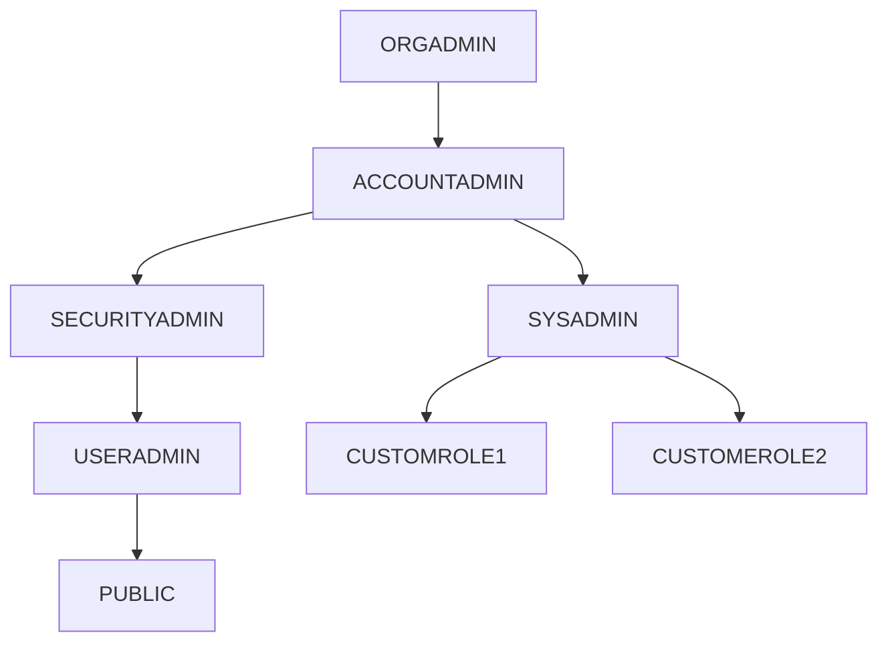
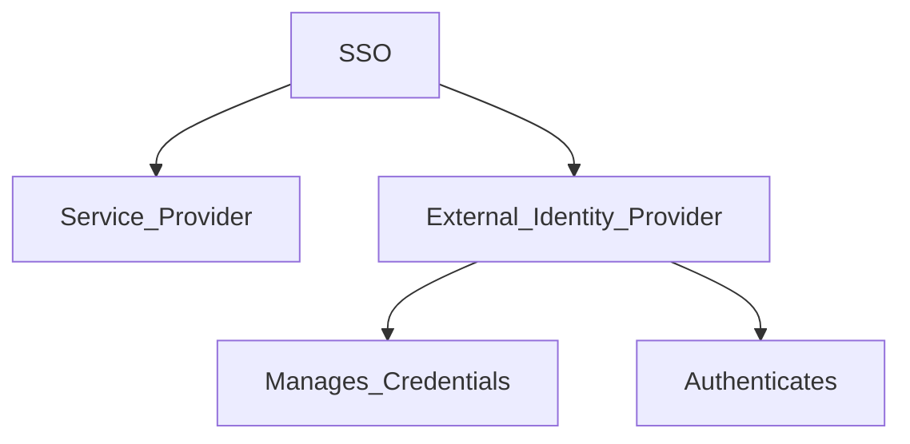

# Access Control 
1. Discretionary Access Control (DAC)
    * Each object has a OWNER
    * OWNER can GRANT and REVOKE Priviliges to the Object 
2. Role-Based Access Control 
    * Priviliges can be Granted to **Roles** or **Multiple Roles** 
    * Those **Roles** can be Assigned to **Users** 
    * Role can have **Multiple Priviliges**
    * Users can have **Multiple Roles**

# Hierarchy of System Defined Roles. 
1. 

2. Parent needs to be granted privileges to add privileges to Child objects. 
3. ORGADMIN: 
    * Manage Accounts. 
    * View Account Usage. 
    * Create Accounts. 
    * Manage ORG Properties. 
4. ACCOUNTADMIN: 
    * Top-Level Role. 
    * Have all the privileges. 
    * Have **SecurityAdmin** and **SysAdmin** under it. 
    * Can Manage and execute anything on any Object. 
    * Dedicated Account Privileges are for:
        * Share 
        * Reader Accounts. 
    * Manage Billing and Resource Monitors. 
5. SECURITYADMIN: 
    * Has **Manage Grant Privileges** Globally. 
    * Can Manage Users, Roles as it has the privileges of **USERADMIN**
6. SYSADMIN:
    * Can create any objects. 
    * Manages **Custom Roles** if gratned to SysAdmin. 
    * Snowflake Recommends to grant Custome Roles to SysAdmin, so it will have a higher power to manage the custom role's Objects. 
7. USERADMIN:
    * Can create and manages,  Users ,and, roles
    * Manages Roles that USERADMIN have the OWNERSHIP of
8. PUBLIC: 
    * Granted to when no access control neeed so anyone can see it and use it. 
    * Objects can be owned by everyone and available too. 
7. CUSTOM ROLE. 
    * Can be created only by **USERADMIN** or **Higher**
    * Should be grated to **SYSADMIN**

# Priviliges: 
1. Global Privileges. 
    * Create Share
    * Import Share
    * Apply Masking Policy. 
2. Object Privileges. 
    1. Warehouse: 
        * Modify: Alter Warehouse Properties and Settings eg. Resizing. 
        * Monitor: View Executed Queries 
        * Operate: Alter Warehouse State eg. Suspend or Resume
        * Usage: Use and Execute Queries in Warehouse
        * All: Contains all Privileges except OWNERSHIP
        * OWNERSHIP: Full Access to Warehouse. 
    2. Database: 
        * Modify: Alter Properties and Settings of Database. 
        * Monitor: View Queries and Describe Command
        * Usage: Use Database and Execute Queries along with Show Command
        * Reference_Usage: Can refernece object outside of the native database
        * Create Schema: Privileges to create schema
        * All: same as above
        * Ownership: same as above. 
    3. Stage: 
        * READ: Read data from Internal Stages eg. GET, LIST, COPYINTO table. Only for Internal Stage
        * USAGE: Only for External Stage
        * WRITE: Write Data to Internal Stage eg. PUT, REMOVE, COPYINTO Location. Only for INternal Stage. 
        * All: Same as Above
        * Ownership: Same as Above
    4. Table: 
        * Truncate: Using Truncate Command on the Table
        * Select: Using Select Command on the Table
        * Insert: Inserting Values in to the table and manually re-clustering tables
        * Update: Using Update Command on the Table
        * Delete: Using Delete Command on the Table
        * All: Same as Above
        * Ownership: Same as Above
    
# Multi-Factor Authentication. 
1. Enabled for all the Editions. 
2. Need to Enroll
3. SecurityAdmin or AccountAdmin can Disable MFA for a User. 
4. Powered by DUO.
    * No Signin. 
    * Just Install 
5. Supported Devices: 
    * WebUI
    * SnowSQL
    * Snowflake ODBC and JDBC
    * Python Connector
6. Also can use MFA Token Caching
    * Needs to be Enabled First.
    * Has 4 Hours Validity. 
    * Can reduce number of prompts when authenticating 
    * Supported Devices: 
        * ODBC Drivers Version 2.23. 0 (or Later)
        * JDBC Driver Version 3.12.16(Or Later)
        * Python Version 2.3.7(or Later)

# Federated Authentication (SSO)
1. Enterprise Level 
2.      

3. Any SAML 2.0 Complient Vendors are supported as Identity Provider (IdP). 
4. Natives are: 
    * Okta
    * Microsoft AD FS
5. Use a single set of Credentials to loginin or authenticate. 
6. Avaialble to: 
    * Login
    * Loginout
    * Timeout due to Inactivity
6. Can also use **SCIM**: 
    * Can Visit the IdP Website 
    * Open Standard for automating User Provisioning
    * Create the User. 
    * This will Provision the User to snowflake automatically.

# Key Pair Authentication. 
1. Little more advanced than the basic Email and Password Authentication. 
2. Need one or Two Public Key. 
3. Need a Private Key. 
4. Minimum of 2048-bit RSA Key Pair
5. Can be connected via Snowflake Clients like SnowSQL 
6. Not Used to logging in via Web Interface. 

# Column Level Security: 
1. Enterprise Level 
2. Mask Data
3. Types:
    * Dynamic Data Masking
        * Realtime Role based Masking
    * External-Tokenization. 
        * Loaded Pre-load Tokenized 
        * Runtime Detokenized

# Low Level Security: 
1. Filter Data According to the **Conditions** 
2. Runtime Filtering according to the conditions
3. Supported throught **Row Access Policy** 

# Network Policies. 
1. Can add **Aceepted_Ip_List** and **Denied_IP_List**
2. if N/A in Denied IP List only the IP from the Accepted IP List will be allowed. 
3. We need SecurityAdmin Role and **Global Create Network Policy** Privileges. 
4. We need **OWNERSHIP** Priviliges to use this on USER Level

# Data Encryption. 
1. Data is always encrypted all the time
    * Even in: 
        * Transit
        * Rest
2. Rest: 
    * Data is fully Encrypted. 
    * Use 256 AES Encryption
    * 30 Days Key Rotation. 
    * Re-Keying can be used/enabled by **Enterprise Level**
        * 365 Days 
    * Old Keys are Deleted.
3. Transit:
    * Datas are always Encrypted. 
    * Uses TSL 1.2 Encryption. 
4. External Stage, Client-Side Encryption is Used. 
5. Tri-Secret Secure
    * Used by Customers Key + Snowflake Key = Master Key (Composit Key)
    * Need to Contact Snowflake Supprot to enable this
    * Starts from Business Critical Edition. 
    * Customer needs to maintain, manage and have responsibility

# Account Usage and Information Schema
1. We can Query **Object Metatdata and Historical Usage Data**
2. 
|Account Usage|Information Schema|
|-------------|------------------|
|Snowflake Database|Avaliable in all Database|
|Retention Period: 365 Days| Retention Period: 7 Days - 6 Months|
|Dropped Objects are Listed| Dropped Objects are not Listed|
|Latency: 45 Min - 3 Hours| Latency: Real-Time Update|

# Release Process. 
1. Stages: 
    * Day One: Early Access for Designated Enterprise Editions or Higher. 
    * Day One or Two: Regular Access for Standard Editions. 
    * Day Two: Final Access to Enterprise or Higher
2. Types:   
    * Full Access
        * Bug Fixes
        * New Features
        * Enhancements or Updates. 
        * Behaviour
         Changes
            * This affect Workflow and Code 
            * Monthly Release
    * Patches
        * Bug Fixes
3. No Downtime