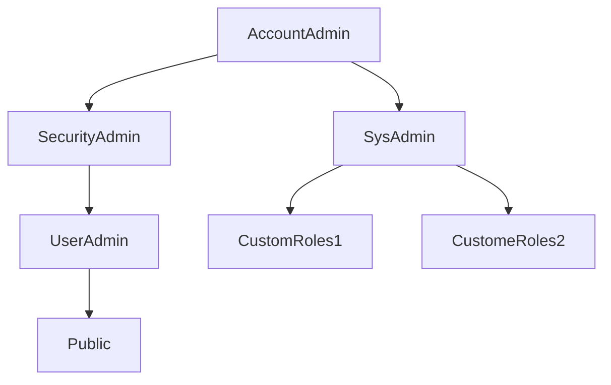

# Account & Security. 

## Access Control in Snowflake

### Two Main ASpects
1. Discretionary Access Control (DAC)
    * Each Object has a owner. 
    * Owner can grant access to that object. 
    * Which means Owner can also grant previleges to the object. 
2. Role-Based Access Control (RBAC)
    * This is a model that uses Privileges on Objects that can be granted to roles and those roles will be assigned to the Users. 
    ```mermaid
    graph TD;
        Privileges-->Roles;
        Roles-->Users;
    ```

### Four Key Concepts. 
|Types|Decriptions| 
|-----|-----------|
|Securable Object|This is an object that Acccess can be granted, but access is denied unless granted|
|Privileges| This level of access is called Privileges, this is just the defined and granular level of access to a securable object| 
|Role| This Privileges will be granted to a **Role** and the role will be assigned to Users or Other roles.| 
|User|Identity associated with person or program that is then loggin in to the account.|

eg: 
1. Assume we currently a User in a worksheet, now we want to create a **Table**, and we need a current role selected in a worksheet as the context and this role is creating a table and because this role created this table, this **Role** will be the Owner of the table and **Then if Needed** can grant **Privileges** to another Role on this object. Now the role that contains all the Privileges, we can assign that role to the **Users**, this will also be done by the **Grant** Command 
2. One Role can have multiple Privileges. 
3. One User can have multiple Roles. 
4. Commands: 
    * 
    ```sql
    GRANT <privilege> ON <object> TO <role>
    ```
    * 
    ```sql
    GRANT <role> TO <user>
    ```

### Hierarchy of System Defined Roles. 


* When we are grant privileges to a child object we need to grant privileges to the parent object. 

* Every Object is owned by one single owner **Ownership Privileges**
* Ownership can be transferred
    * Ownership have Grant and Revoke Privileges
    * All Privileges per default. 
    * Active role in the session. 

## Roles. 
1. Roles are the entity that privileges are assigned to. 
2. Current role should be selected in every session and this is called **Primary Role**


### System Defined Role. 
1. These Roles can't be dropped. 
2. Privileges can be added to these role but can't revoked. Hierarchy. 
3. We can also custom role and as best practice we need to assign them to the Sysadmin. 

### Roles. 
1. ORGADMIN. 
    * Manages action on organizational level
    * Create additional accounts in the Org. 
    * View all accounts. 
    * View account usage information. 
2. ACCOUNTADMIN. 
    * This is the **TOP-LEVEL** role. 
    * This role should be limited number of users. 
    * This contains **SecurityAdmin & SysAdmin**
    * This can manage all objects in account. 
    * This is also dedicated to the account objects for eg. we need create a **readers account** or a **share** then we need to use **AccountAdmin**
    * Modify account-level parameters. 
    * Mange billing & resource monitors. 
3. SECRITYADMIN. 
    * This role can **Manage any object grant globally**. 
    * Manages Grant Privileges. 
    * Create, Monitor, and mange users and roles. 
    * inherites **UserAdmin** Privileges. 
4. SYSADMIN. 
    * This is there to **Manage the Objects**
    * This admin can create warehouses, databases and other objects. 
    * All custom roles should be assigned to **SYSADMIN** if not assigned and when the custom roles creates any warehouse or objects, sysadmin cannot control the objects that was created and wont inherit it. 
5. USERADMIN. 
    * Dedicated to user and role management. 
    * This role can CREATE USER AND CREATE ROLE Privileges. 
    * Can manage users and roles that are owned by this role. 
6. PUBLIC. 
    * Which is a sudo role. 
    * This is automatically granted for all the users per default. 
    * Granted to when no access control needed so anyone can see it then we use it. 
    * Objects can be owned by are available to everyone. 
7. CUSTOM ROLES. 
    * Can be created by the **UserAdmin** or Higher. 
    * Create role Privileges. 
    * Should be assinged to Sysadmin, otherwise, **SysAdmin** won't be able to manage objects created by these roles. 
    * Custom database roles can be created by owner.

## Priviliges. 
1. This is the granular level of access
2. Priviliges are Granted to Roles. 
3. Roles are then Granted to Users. 
4. We can also revoke Priviliges. 
5. This can be usually be possible by the **Ownership** role.
6. Also there is **Manage Grants** Privilige which is a **Global** Priviliges. 
7. This **Manage Grants** priviliges that the **SecurityAdmin** has so they can grant and revoke priviliges.

### Some Common Priviliges. 

#### Global Priviliges 
|Global Priviliges|DESC|
|-----------------|----|
|Create Share| Enables Provider to create a share. |
|Import Share| Enables to create a database. |
|Apply Masking Policy|Enables to set masking policies.|


#### Specific Priviliges on Different Object Types. 
##### Virtual Warehouse. 
|Virtual Warehouse Priviliges| DESC| 
|----------------------------|-----|
|Modify|Enables to alter properties of a warehouse --e.g Resizing| 
|Monitor|Enables to view Executed queries by the warehouse| 
|Operate|Enables to change the state of the warehouse (eg. suspend and resume)| 
|Usage|Enables to use the warehouse and execute queries.| 
|Ownership|Full Control over the warehouse| 
|All|All Priviliges apart from Ownership| 

##### Databases
|Database Priviliges|DESC|
|-------------------|----|
|Modify|Enables to alter properties and settings of a database| 
|Monitor|Enables to perform **DESCRIBE** Command| 
|Usage|Enables to use the database and execute **SHOW DATABASE** command, and if we want to query from a database we need USAGE priviliges|
|Reference_Usage|Enables Using an object(Shared Secure View) to reference another object in a different database.|
|All| All priviliges apart from **Ownership** Priviliges|
|Ownership| Full Control over the database| 
|Create Schema| Enable creating a schema in the database| 


##### Stages. 
|Stage Priviliges|DESC| 
|----------------|-----|
|READ|Enables to perform operations that require reading(eg. GET, LIST, COPY INTO table) from internal stages; **not applicable to external stage**| 
|USAGE| Enable to use an external stage; not applicable to internal stage| 
|WRITE| Enables to perform writing to internal stage(PUT, REMOVE, COPYINTO location); **not applicable to external stage**|
|All| All priviliges apart from Ownership|
|Ownership|Full Control over the Stage|

##### Tables. 
|Table Priviliges| DESC| 
|----------------|------|
|SELECT|Using Select to query table| 
|Insert| inserting values into the table and manually re-clustering tables.| 
|Update|Using Update Command on the Table| 
|Truncate| Using Truncate command on the Table|
|Delete| Using Delete command on the Table|
|All| All priviliges except Ownership| 
|Ownership| Full control over the database.|

## Multi-Factor Authentication. 
1. Authorization -> Granting the Privileges to the role
2. Authentication -> proving that you are who you say you are. 
3. **Multi-Factor Authentication** provides additional login security. 
4. Powered by **Duo Security** but managed by **Snowflake**
    * NO Signup 
    * ONly Installation.
5. It is enabled for accounts by default but we need to **Enroll** by the users. 
6. Strongly recommended for **AccountAdmin**
7. **SecurityAdmin** or **AccountAdmin** can disable **MFA** for Users. 
8. Supported by: 
    1. Web Interface
    2. SnowSql
    3. Snowflake ODBC and JDBC 
                &
    4. Python Connectors. 
9. We can also use **MFA Token Caching** which can reduce the number of prompts during authentication. 
    * Needs to be enabled first. 
    * MFA token is valid up to **4 Hours** 
    * Valid for: 
        1. ODBC Driver Version 2.23.0(or later).
        2. JDBC Driver Version 3.12.16(or later).
        3. Python Connector for Snowflake Version 2.3.7(or later)

## Federated Authentication (SSO)
1. Enables Users to use login via **SSO**. 
2. This means they can use one set of credentianls and use this to login to Snowflake also other applications. 
    * This is available for: 
        1. Login
        2. Logout
        3. Time out due to Inactivity.
3. This is provided by **Federated Environment**
    ```mermaid
    graph TD;
        Federated_Environment-->Service_Provide_Snowflake;
        Federated_Environment-->External_Identity_Provider;
        External_Identity_Provider-->Maintaining_Credentials;
        External_Identity_Provider-->Authenticate_Users;
    ```
4. For the External Identity Provider:
    * Most **SAML 2.0-Compliant** vendors are supported as an Identity Provider (IdP). 
    * Native Supports for **Okta** and **Microsoft AD FS**

### Workflow - Snowflake-Initiated
1. User navigates to Snowflake WebUI. 
2. Choose login via Configured IdP(eg. *Okta or Microsoft AD FS*)
3. Authenticate via IdP Credentials(e.g. *email and password*)
4. The External Identity Provider (IdP) sends a **SAML** response to snowflake and this will **Opens a new snowflake session**

### Workflow - IdP-Initiated
1. User navigate to IdP. 
2. Authenticate with Credentials. 
3. Select **Snowflake as Application**
4. External Identity Provider (IdP) sends a **SALM** response to snowflake and will open a new session. 

### SCIM Support
* For these Identity Providers there is so called **SCIM Support** 
* SCIM is an open standard for automating user provisioning 
* Create user in IdP, and this will be automatically be **Provision User** directly to the Snowflake. 

## Key Pair Authentication. 
1. Enhanced security as an alternative to basic **Username/Password**
2. In this: 
    * One or Two -> **Public Key** and also a **Private Key** and this makes the **key pair**
    * For this a **Minimum of a *2048-bit RSA Key Pair***
    * And this can be connected via Snowflake Clients (SnowSQL etc.)
    * Not used in Logging in via Web Interface.

### Workflow
1. Generate a Private Key. 
2. Generate a Public Key. 
3. Store the keys locally. 
4. Assign public key to user
    ```sql
    ALTER USER USERNAME SET RSA_PUBLIC_KEY 'PUBLICKEYF_GKDOJFE';
    ```
5. Configure client to use key pair authentication. 

## Column Level Security. 
1. Column-level Security masks data in table and views enforced on columns. 
2. Entireprise Edition Level Feature. 

### Types: 
1. Dynamic Data Masking. 
    * Mask the data **based on** the current **selected role** and on **run time**
    * This is a schema Level object
        * Define Policy: 
            ```sql
            CREATE MASKING POLICY MY_POLICY
            AS(VAL VARCHAR) RETURNS VARCHAR -> 
                CASE
                WHEN CURRENT_ROLE IN (ROLE_NAME)
                THEN VAL
                ELSE '###-###-###'
                END;
            ```
        * Apply Policy: 
            ```SQL
            ALTER TABLE MY_TABLE MODIFY COLUMN PHONE SET/UNSET MAKSING POLICY MY_POLICY;
            ```
2. External Tokenization. 
    * The data is not masked but **Tokenized**
    * One set of characters will get one token value.
    * Like this the data will be protected so we cannot make any confusions but we **Preserve Analytical Value**
    * Original value if it occurs multiple times it Always get the same token
    * Data can be still grouped and we can in the same time protect sensitive data. 
    * **Pre-load** Data is tokenized pre-load and **detokenized** at query runtime

## Row-Level Security. 
1. Supported through **Row Access Policies** to determine which rows are returned. 
2. **Enterprise Edition Feature**
3. Filter a **Row** at runtime accoring to **Conditions**
4. Define Policy: 
    ```sql
    CREATE ROW ACCESS POLICY MY_POLICY
    AS(COLUMN1 VARCHAR) RETURNS BOOLEAN ->
        CASE 
        WHEN 'ROLE_NAME' = CURRENT_ROLE() AND 'VALUE1'=COLUMN1 THEN TRUE
        ELSE FALSE
        END;
    ```
5. Apply Policy
    ```sql
    ALTER TABLE MY_TABLE ADD ROW POLICY MY_POLICY ON (COLUMN1);
    ```

## Network Policies. 
1. Allow to restrict access to account based on User IP Address. 
2. This is a Standard Edition. 
3. We can define **Allowed IP Address** and **Blocked IP Addresses**
4. Blocked IP Address will have the Priority. 
5. We can also use **N/A** and only the IP that are in the **Allowed IP Addresses** will be having access. 

### Create Network Policy 
1. We can use SecurityAdmin Role becuase this has **Global Create Network Policy** Privileges. 
2. Create Network Policy. 
    ```sql
    CREATE NETWORK POLICY MY_NETWORK_POLICY
    ALLOWED_IP_LIST=('192.168.195','192.168.1.113')
    BLOCKED_IP_LIST=('192.168.195');
    ```
3. Apply Network Policy
    ```sql
    ALTER ACCOUNT SET NETWORK POLICY = MY_NETWORK_POLICY;
    ```
4. We can apply this on the User level but for that we need additional privileges of **Ownership** of users & network policy. 
    ```sql
    ALTER USER SET NETWORK_POLICY=MY_NETWORK_POLICY;
    ```

## Data Encryption
1. In Snowflake all data at all time are encrypted. 
2. Encrypted at **Rest** and also in **Transit**

### Encryption at REST. 
1. Has: Tables, INternal Stages. (Everything that has data which is managed by snowflake)
2. **AES 256-bit Encryption** and Snowflaked Managed. 
3. **Key Rotation every 30 Days**. 
4. Old keys will be destroyed. 
5. For Enterprise Edition:
    * If enabled we can **Re-Keying every year** Key Rotation. 
    * This will also change the existing key for all of the tables.

### Data in Transit
1. This is true for all of the connectors, dirvers, interface 
2. Snowflake uses **TLS1.2** so we can have **End-to-End Encryption**
3. Flow for exampel when we **PUT** a file from our local machine 
    ```mermaid 
    graph TD;
        PUT-->Encrypted_on_User-Machine;
        Encrypted_on_User-Machine-->Internal_Stage;
        Internal_Stage-->Encrypted_in_the_stage;
        Encrypted_in_the_stage-->Encrypted_in_Transit;
        Encrypted_in_Transit-->Encrypted_at_rest;
    ```
4. If it's an **External Stage**, which is not managed by snowflake, we can use **Client-Side Encryption**

### Tri-Secret Secure
1. Enables Customer to use Own Keys
2. This is a **Business Critical Edition**

#### Workflow
1. There will be a **Customer-Managed Key**, this usually be based on the cloud provider. 
2. And also **Snowflake-Managed Key** which will give **Master Key** or **Composite Key**

    ```mermaid 
    graph TD;
        Customer_Managed_Key-->Snowflake_Managed_Key;
        Snowflake_Managed_key-->Master_Key;
    ```
3. This Feature can only be **Enabled** by reaching out to **Snowflake Support**
4. Need Management and Responsibility from **Customer Side**

## Account Usage & Information Schema. 
1. We can used to **Query Object Metadata and Historical Usage Data**
### Account Usage Schema. 
1. Snowflake Database which is a **Shared Databased** availabe to all account. 
2. If we have **Role AccountAdmin** we can wee all of the data and can **View Everything**
3. **Object Metadata** -> **Columns**
4. **Historical Usage Data** -> **Copy_Hisotry**
    * Long Term Historical Usage Schema. 
5. Not Real-Time it has **Latency** of **45min - 3 Hours**
6. Data Retention here is Long Term: **365 Days**. 
7. Includes Dropped Objects

### Information Schema 
1. Acutomatically Created. 
2. Read-Only 
3. Output Depends on Privileges 
4. Parent DB + account-level 

#### Points to Remember.
1. No Latency. 
2. Retention Period is from **7 Days - 6 Months**


## Release Process
1. How are Releases Deployed? 
    * On a Weekly Basis. 
    * Weekly New Releases
    * A Seamless Process without any downtime, **NO Downtime**

### Types of Releases
1. Full Releases
2. Patch Releases

#### Full Releases

    ```mermaid
    graph TD;
        Full_Releases-->New_Features;
        Full_Releases-->Enhancement_or_Updates;
        Full_Releases-->Bug_Fixes;
        Full_Releases-->Behavior_Changes;
        Behavior_Changes-->Monthly_Releases;
        Behavior_Changes-->Impact_on_Workload;
    ```
#### Patch Releases. 
1. This only contain the bug Fixes


### Three Stage Approach. 
1. Helps to Monitor and react to Issues. 
2. Day 1
    * **Early Access** -> Designated Enterprise (or Higher) accounts (Enterprise Editoin)
3. Day 1 or Day 2
    * **Regular Access** -> Standard Account
4. Day 2
    * **Final Access** -> Enterprise(or Higher) Accounts.