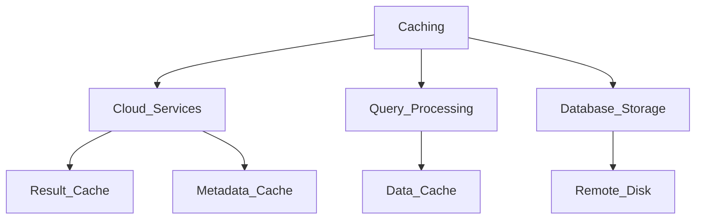

# Performance Concept. 

## Query Profile
1. Provde execution details for a query.
2. Its a Graphical Representation from our Snowflake UI
3. We will get additional execution details

### When to Use? 
1. When to understand **Mechanics of a Query** 
2. We can imporove the **Performance and Behavior of a Query**
3. To Identify **Performance Bottlenecks**

* This Query profile is availbe to all of the queries, **Completed**, **Failed**, and **Running**

### Where we can find this Query Profile? 
1. In our **Query History** in our **Activity Section** there we can find the queries and query profile 
2. We can also **Navigate to the Query Profile** straight from the Worksheet where we ran the **last Query**

### Different Components of the Query Profile. 
1. Operator Tree. 
    * Which is the graphical representation of the different **Nodes**
2. Nodes. 
    * Build blocks of our Operator tree
3. Operator Type. 
    * All these different nodes will have different **Types**
    * These are the different aspects of query processing and execution of our query
4. Data Flow
    * No of records processed between those different nodes
5.  Percentage. 
    * Percentage of time this operator needed
6. In Side:
    * Overview
        * Where time was spent 
    * Statistics
        * **Bytes Scanned, Scanned from Cache, and Data Spilling**

### Data Spilling
1. We can find that in the Query Profile in the side in the **Statistics** options. 

#### When does this occur?
1. When we have a Warehouse there is always some memory of the warehouse
2. When the data of this memory is not fit in this memory anymore this will spill the data to the **Local Storage**, and this slows down the query performance. 
3. The **Memory** is fastest in the query Processing and if this has to be spilled to the local storage this takes more time and slows down the performance. 
4. If the **Local Storage** is not enough anymore the data spilled to the **Remote Cloud Storage** an external bucket will be created and the data will be spilled to this external bucket, and the **Performance** will slow down even more. 
5. And this **Data Spilling** is something we need to avoid. 

### How can we avoid it? 
1. Sometimes there is not much we can do. 
2. Sometimes we cannot prevent it enterly. 
3. So General: 
    * We can reduce the amount of data Processed by changing our query
    * And also we can reduce the amount of query that are run in parallel so the data spilling wont occur and the memory will be enough. 
    * Additionally we can increase the **Size of the Warehouse** , if this happen frequently we can increase the performance quite a lot by increasing the size of warehouse, with this the memory will also be increased and this is how we can also avoid the spilling

### 3 Ways to access the query history
1. Query History in **Snowsight**
2. Query_History Table Function in **Information Schema** 
3. Query_History View in **Account Usage**

## Caching


### Result Cache
1. When a user executed a query this will be Cached Copy of the query result
2. This stores the **Result** of a query and this is located in the **Cloud Service Layer**
3. Same queries can use that cache in the future, but the query needs to run with the same syntax
4. Also, Table data should not be changed. 
5. Also, the Micropartitions should not change, for example like clustering etc or the data has been redistributed then this won't work
6. Query cannot contains UDFs or External Functions. 
7. We need **Sufficient Priviliges** and **Results are still Available**
8. This avoids the usage and re-execution of the warehouse. 
9. This by default is **Enabled** but can be **Disabled** if needed using **USE_CACHED_RESULT Parameter**
10. This data will be **Purged** after **24 Hours** if the query has not be re-run. 
11. If the query has ran then the data will be **Purged** only up to 31 days. 

### Data Cache
1. Local SSD Virtual Warehouse Cache
2. In Query Profile we can see the name as **Local Disk I/O**
3. This is also called **Virtual Warehouse Cache**
4. Specific to a given Warehouse. 
5. This can also use to **Increase the Performance** of subsequent Queries that use the same **Underlaying Data**
6. If the Warehouse is **Suspended** or **Resized** then the data will be **Purged**
7. We can run similar queries that use the same Underlying data of the same warehouse. 
8. Size depends on the warehouse size. 

### Metadata Cache
1. This just contains the Statistics for the tables and columns and Micro-Partitions
2. This also contains metadata of Objects. 
3. This includes also Properties for **Query Optimization and Processing**
4. Some pre-calculated Statistics are stored 
    * for table for example: 
        * Can be a range of values in different **Micro-Partitions** , **Max/Min** 
        * Count Rows, Count Distinct values.
        * Without using virtual warehouse
        * DESCRIBE/SHOW + System-Defined functions
        * This Sometimes called **Meta-Data Store**
5. For Virtual Private Edition there is a **Dedicated Metadata Store** that is not shared with any other customers. 

### Remote Disk
1. If the data is not cached the we need to retrieve it from the **Storage Layer**, this is not a caching **Mechanisim** but this is also where data is pulled from but then will be much slower comparing pulling from the data cache

## Micro-Partitions

### Storage. 
1. The data is stored in the External Cloud Provider of the Snowflaks account that we selected. 
2. How the data is physically stored in the coloud provider?
    * Micor-Partitions
    * MP can have 50-500MB of Uncompressed Data 
    * Data is compressed automatically, based on the data in the Micro-Partitions so snowflake will find a the best Compression Algorithm so the actual size of the MP is less. 
    * Allow very **Granular Partition Pruning**
    * Eliminates unnecessary partitions when querying
    * Can have Millions and billions of partitions. 
    * Data is stored in **Columnar Format**
    * We can't disable it this is a standard features
    * MP are **Immutable** They can't be changed. 
    * New data == New Micro-Partitions. 
    * By introducing **Clustering Key** we can add an influence on performances. 

### Metadata in Micro-Partitions. 
1. Range of the values in the Micor-Partitions. (Range of Values can also **Overlap**)
2. No#. of Distinct Values.
3. Additional Properties for query optimization. 

## Clustering 
1. Clustering table on a specific column redistributes the data in the micro-partions. 
    * Improve access to this column 
    * Optimized partition pruning. 

### Metadata Stored. 
1. Number of Micropartitions in table. 
2. Overlapping Micro-Partitions. 
3. Clustering Depth.

#### Overlapping MP 
1. Have Number of partions that overlap 

#### Clustering Depth. 
1. Average depth of the overlapping micro-partitions for specif column. 
2. In howmany Micro-Partions value occurs. 
3. **Lower Average Depth** We clusterd Table and fewer **Overlapping Micro Partition more well clusterd Table**
4. Ideal(Constant Stage/Partition):    
    * No Overlapping Micro Partion
    * Average Depth: 1. 
    * If Overlapping Micro Partion number is **High** then this would be really Good.

1. **By Improving Clustering Key we want to achieve the Ideal State**
2. Similar rows in the similar Micro-Partitions. 


### Benifit: 
1. Improved Query Performance. 
2. Better Scan Efficiency.
3. Better Column Compression (Especially When Columns are similar)
4. NO Future Maintanance. 

## Defining Clustering Keys. 

1. Reclustering won't happen right after we defining clustering keys. 
2. It will only recluster when the snowflake identifies that will actually benifit from reclustering.
3. Automatic Reclustering and this is Cloud Services (Serverless) and this is maintained by Snowflake

### How is this done. 
1. New Partitions are created. 
2. Old Partitions are marked as deleted. 
3. This is actually causing Storage Cost, and cause **Credit Consumption of Reclustering**
4. Old partitions are stored and maintaind for **Time Travle** and for **Fail Safe**
5. Clustering is not good for every table. 

### Trade-off. 
Query Performance <--> Cost

### Which Columns and Which Table can get Benift from Clustering Key? 

1. Large Number of Micro-Partitions. 
    * Very Large Tables. 
    * Multiple Terabytes of Data. 
2. Query Performance
    * Can benifit from **Where**/**Join**/(**OrderBy**)
    * Selective Queries and Sorting of columns => Most Performance improvement. 
    * Orderby not more than Where and Join. 
3. Low enough Cardinality. 
    * **Two Low Cardinality** => **No Effective Pruning** 
    * Eg: Male / Female 
4. High Enough Cardinality 
    * **Two High Cardinality** => **No Efficient Grouping**
    * **Overhead for Micro-Partitioning**

### Clustering Keys SQL Commands. 
1. We can introduce Clustering Key on One or More Columns. 
    ```sql
    ALTER TABLE T1 CLUSTER BY (C1,C5);
    ```
    * Go From Low Cardinality to High Cardinality
    * If we do other way around the **Low Cardinality Column** wont be benifited from the Clustering Key. 

2. WE can also use Expression. 
    ```sql
    ALTER TABLE T1 CLUSTER BY (DATE(timestamp));
    ```
3. We can Create table with cluster key. 
    ```sql
    CREATE TABLE T1 CLUSTER BY (C3,C8);
    ```
4. Drop a clustering key:
    ```sql
    ALTER TABLE T1 DROP CLUSTER KEY;
    ```

## System Functions on Clustering. 
1. **SYSTEM$CLUSTERING_INFORMATION('TABLENAME',['(COLUMNS/EXPRESSIONS)'])**
    * Returns a Json with Information
2. **SYSTEM$CLUSTERING_DEPTH('TABLENAME','COLUMNS')**
    * Returns a depth value for the columns

## Search Optimization Service. 
1. This is an Enterprise Edition. 
2. Can improve performance of certain **Types** of **Lookup** and **Analytical Queries**. 
3. This uses **Many *Predicates* for Filtering**
4. This Features works by adding a **Search Access Path**  to a table, like this we can benifit for a better performance for very **Specefic Types of Queries**
5. This Adds Search Optimization to Column

### Benificial Quries

|Beneficial Queries| DESC|
|-------------------|-----|
|Selective Point Look-Up| These are Queries that have a Filtering which Returns on one or very few rows|
|Equality Predicates(=) or IN Predicates|eg. Where Amount =1|
|Substring and regualr Expression searches| eg. LIKE, or ILIKE, VARIANT column| 
| Selective Geospatial Functions| with GeoGraphy values|


1. These Features are mainted automatically by **Snowflake** for a different **Column** or Different **Table**
2. Serverless Features and consume Credits. (Serverless Cost)
3. Also, Additional Storage Needed for **Maintaining the *Search Access Path***

#### Priviliges we need. 
1. Ownership Priviliges on the Table 
                or 
2. ADD SCHEMA OPTIMIZATION Privileges on Schema Level

### Refering Commands. 
```sql
ALTER TABLE MY_TABLE ADD SEARCH OPTIMIZATION; 
ALTER TABLE MY_TABLE DROP SEARCH OPTIMIZATION;
```
                    **Also**
```sql
ALTER TABLE MY_TABLE ADD SEARCH OPTIMIZATION ON EQUALITY(*);
ALTER TABLE MY_TABLE ADD SEARCH OPTIMIZATION ON GEO(GEO_COLUMN);
```

## Materialized View

1. Method to handle performance issues of view. 
2. This is an **Enterprise** Edition. 
3. Consider: 
    1. We run a Query Frequently, to make things more convineat and easier we dicided to create a **View** that is just **executing** and **Storing** these **Queries**. So then we need to query the view and get the results. 
    2. Problem is, if the Query is more compute-intensive, it will cost over and over for compute and also not so great in Performance. 
    3. Solution is **Materialized View**, This is also a **View** but **Similar to a *Real Table***
    4. Because the result of these view are Stored Physically, so it is **Pre-Computed** and **Stored Physically** Like a real table. 
    5. This can **Boost the Performance** Which can specially **Sufficiently Complex** so we get and **Additional benifit** because of this Pre-Computation and physical storage of this pre-computed data. 

### How is it different to a real table? 
1. The Underlying data that is coming from the base table can of course change and this will then be automatically also updated periodically by snowflake. 
2. **Serverless Compute** and **Serverless Costs**
3. Data is stored physically so it can also cost **Additional Storage Consumption**
4. 
```sql
SELECT * FROM TABLE(INFORMATION_SCHEMA.MATERIALIZED_VIEW_REFRESH_HISTORY());
```

### Limitations. 
1. ONly Query from 1 Table 
    * Espically we cannot use **JOINS** even self-joins are not allowed in **Materialized View**
2. No Underlying Views can be used, We are only suppose to Use **Real Base Table** and this is also true for Materialized view.
    * But we can make a Materialized View on an **External Tables.**
3. We cannot Use: 
    1. Window Functions. 
    2. UDFs.
    3. HAVING CLAUSE.
    4. ORDERBY
    5. And also a few Aggregation functions can not also be used. 

### Pause and Resume Materialized View. 
1. We can pause and resume Materialized view easily as other objects. 

```sql
CREATE MATERIALIZED VIEW V1 AS SELECT * FROM TABLE 1 WHERE C1=200;
ALTER MATERIALIZED VIEW V1 SUSPEND; 
ALTER MATERIALIZED VIEW V1 RESUME;
```

2. Suspending the Materialized view will only stop the **Maintenance** of this view, so it will not cause any credit consumption and  we cannot use the materialized view until RESUME; 

3. This will mostly not save cost, but it will usually just delay it, becuase when we resume it again, then there has to be some update, some maintenance that has to be done, so this is usually just more delaying the cost instead of saving them. 

4. We can also drop them when we don't need it anymore. 


## Warehouse Considerations. 
|Considerations|DESC|
|--------------|-----|
|Resizing|Warehouses can be resized even when query is runnin gor when suspended. Impact only **future queries**, not on the running one.|
|Scale Up Vs. Scale Out| **Scale Up: ** When the Queries are more Complex, **Scale Out:** More users (More Queries)| 
|Dedicated Warehouse| Isolated workload of specific user,Different type of workload => Different Warehouse, also enables **Auto-Suspend** and **Auto-Resume** (Available for all warehouse)|

