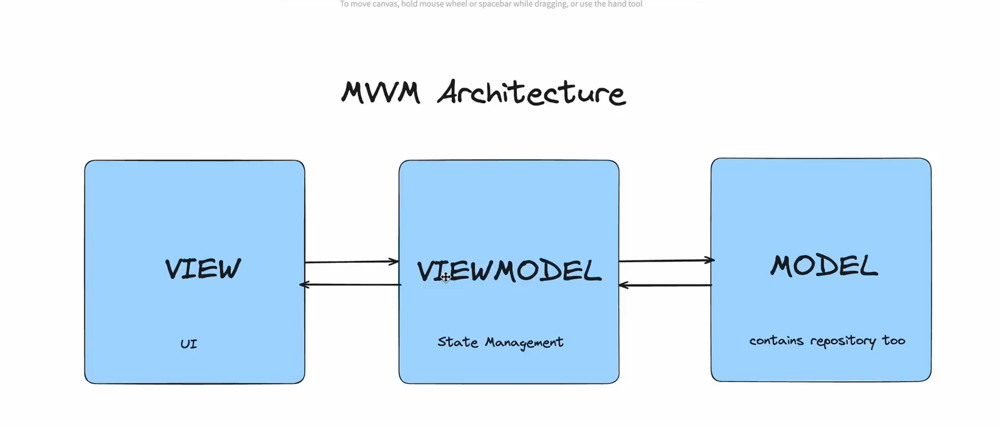
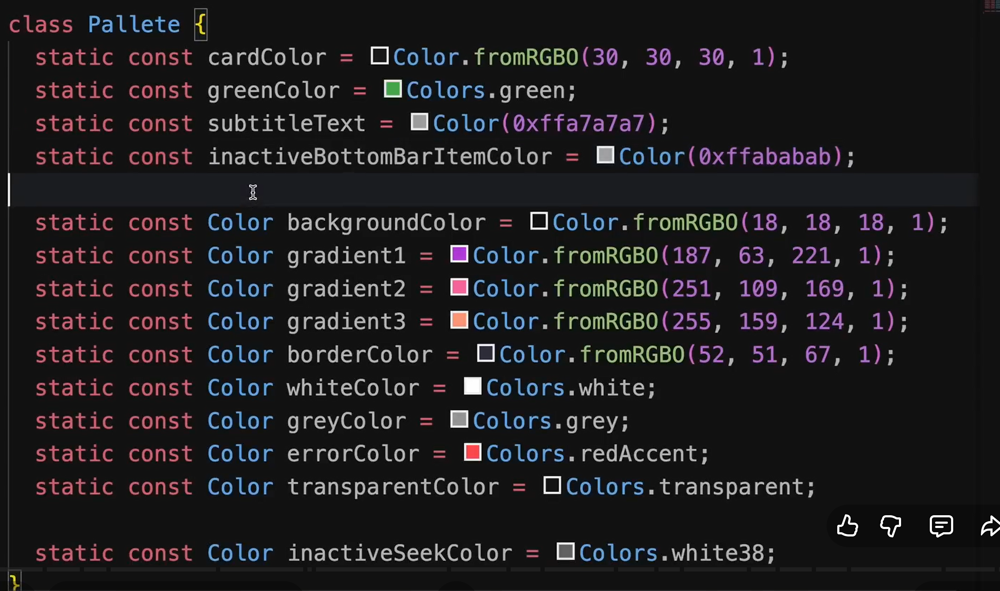
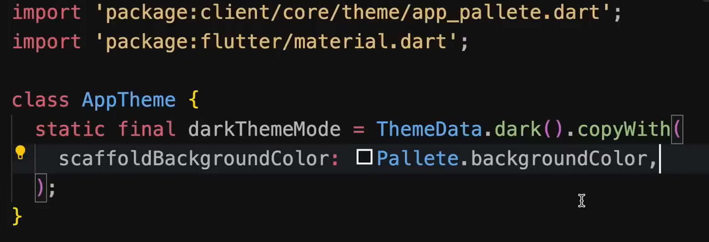

# Building a Spotify Like Clone

## What do we use here

1. MVVM Architecture
2. Flutter for Frontend
3. FastAPI for Backend
4. PostgresSql for Database
5. Hive for local DataStorage
6. Riverpod for StateManagement
7. Auth State Persistant

## Extensions and Other Needed Information

### Extension

1. Flutter Widget Snippets by Alexis Villegas Torres
2. Error Lens by Alexander (If needed install, not required)

### Other Needed Information

1. How to do formatting?
   1. ```ctl + p``` to go to settings on Windows.
   2. Search for ```format on save``` and enable ```Editor: Format On Save``` Option

## Main Folder Required Files/Folder

1. Client :> flutter create . (Which create all the file & folder with this command)
2. Server :>

## MVVM Architecutre

1. View :> V
2. ViewModel :> VM
3. Model :> M



### What are each components and how do they interact with each other?

#### Model (Contains repository/ Database/ API)

1. Represent the data and business logic of the application.
2. It is responsible to handle data that is coming from database, or API or anyother source

#### View (UI)

1. Represent the UI Components that display the data
2. All UI related stuffs.

#### ViewModel (State Management)

1. Acts as a birdge between View and Model.
2. Handles the logic to present the data to view and respond to user's actions.
3. It manages what state the view is showing eg(Is it showing a circular progress indicator or is it showing a data? or is it showing an error message? etc..)
4. VM determines weather view should show it or not.

## Structuring Folders/Dir

Basic Folder Structure:

1. Inside Lib:
   * core :> That contains all resources that are shared across all the features in the application.
     * theam/
       * app_pallet.dart:
         * 
       * theme.dart:
         * 
       * a
       * a
       * a

2. Because the folders can pile up a lot of files a lot quickly.
3. We can use ```feature vise development```
   1. Auth feature
   2. Home feature
4. All the feature will have it's own View, Model and ViewModel
5. We use this because, if needed to clean up this will be easy because.
   * Files and classes created inside auth feature cannot be used in home feature.
   * If auth features are called inside the home feature then deleting the auth feature will have errors across all features eliminating the purpose of Feature-Wise development.

### Inside View Folder

1. We will have 2 sub folder.
   1. pages.
   2. widgets. (Reusabe widgets across the view folder)
